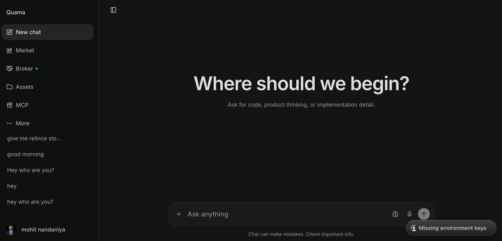
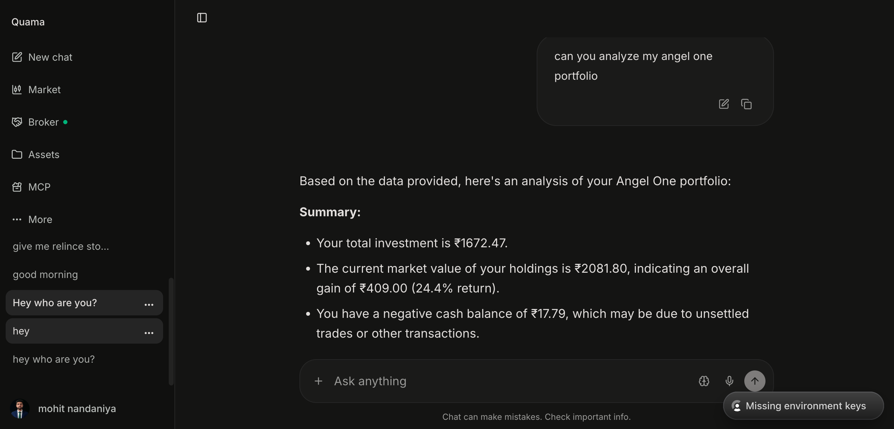
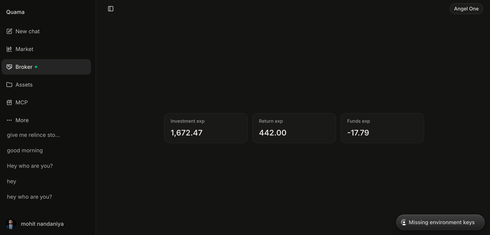
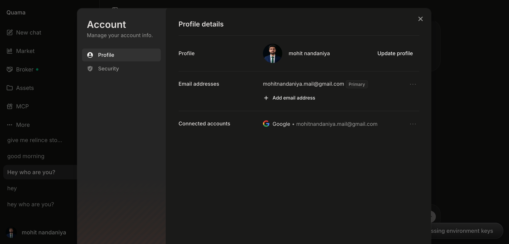

# Quama

Quama is an agentic AI chat and trading-assistant platform with real-time portfolio sync, live market data, broker connectivity, and multi-LLM support.

## Project Flow

The repository is organized as a monorepo with three main runtime paths:

1. Backend API in [backend/](backend/) handles chat, auth, broker sessions, assets, portfolio sync, and market data services.
2. Frontend app in [frontend/](frontend/) serves the user interface and talks to the backend API.
3. Market worker in [backend/workers/](backend/workers/) streams live market data when enabled.

The usual local flow is:

1. Copy environment files.
2. Install dependencies.
3. Run database migrations.
4. Start the backend and frontend.
5. Start the worker only if you need live market streaming.
6. Run quality checks before committing.

## Prerequisites

- Python 3.11+ with `uv`
- Node.js 20+ with `pnpm`

## Quick Start

Create local environment files first:

```bash
cp backend/.env.sample backend/.env.local
cp frontend/.env.sample frontend/.env.local
```

Then install and run the app with the top-level Makefile:

```bash
make setup
make backend-dev
make frontend-dev
```

`make setup` checks dependencies, creates env files, installs backend and frontend packages, and runs migrations.

If you prefer manual steps:

```bash
# Backend
cd backend && uv sync --all-groups && uv run alembic upgrade head && uv run uvicorn app.main:app --reload --host 0.0.0.0 --port 8000

# Frontend
cd frontend && pnpm install && pnpm dev
```

## Running Services

- Backend API: `make backend-dev` or `cd backend && uv run uvicorn app.main:app --reload --host 0.0.0.0 --port 8000`
- Frontend app: `make frontend-dev` or `cd frontend && pnpm dev`
- Market worker: `make worker` or `cd backend && uv run python -m workers.market_data`

## Deploy Backend On Render

Create a Render Web Service from the `backend/` directory using the Dockerfile in
that directory. The container command binds to Render's `PORT` environment
variable and falls back to `10000` locally.

Set at least these backend environment variables in Render:

```bash
DATABASE_URL=<your Render Postgres internal or external database URL>
BROKER_TOKEN_SECRET=<a Fernet key>
ALLOWED_ORIGINS=<your frontend origin>
CLERK_AUTHORIZED_PARTIES=<your frontend origin>
DEBUG=false
```

`ALLOWED_ORIGINS` and `CLERK_AUTHORIZED_PARTIES` accept comma-delimited origins.
Use origins only, such as `https://quama.example.com`, without a trailing path.
Restart the Render service after changing them.

Render/Postgres URLs such as `postgresql://...` and `postgres://...` are
normalized automatically to SQLAlchemy's async driver format at startup.

Generate `BROKER_TOKEN_SECRET` with:

```bash
python -c "from cryptography.fernet import Fernet; print(Fernet.generate_key().decode())"
```

## Deploy Frontend On Vercel

Set these frontend environment variables in Vercel before rebuilding:

```bash
VITE_API_BASE_URL=https://<your Render backend hostname>
VITE_CLERK_PUBLISHABLE_KEY=<your Clerk publishable key>
CLERK_SECRET_KEY=<your Clerk secret key>
```

Do not add the local backend port `8000` to the Render URL. Browser requests from
the deployed frontend also require that exact frontend origin in the backend
Render service's `ALLOWED_ORIGINS` value.

`CLERK_SECRET_KEY` is required by the frontend server middleware. Keep it
server-side only: do not prefix it with `VITE_`.

## Quality Checks

Run the full local gate:

```bash
make ci-local
```

Individual checks are also available:

```bash
make ci-backend
make ci-frontend
make backend-lint
make frontend-lint
make frontend-typecheck
```

## Useful Make Targets

- `make check-deps` verifies Python, `uv`, Node.js, and `pnpm`
- `make db-setup` runs Alembic migrations
- `make db-reset` resets and reapplies migrations
- `make dev` prints the recommended multi-terminal startup flow
- `make clean` removes generated files and caches

See [Makefile](Makefile) for the full command list.

## Tech Stack

- Backend: FastAPI, SQLAlchemy, PostgreSQL, Redis, Pinecone
- Frontend: TanStack Start, React 19, TypeScript, shadcn/ui, Tailwind
- Auth: Clerk
- Broker integration: Angel One Smart API
- LLM providers: OpenAI, Google Gemini, Groq

## Repository Layout

- [backend/](backend/) - API, services, models, migrations, and worker code
- [frontend/](frontend/) - web app workspace and UI packages
- [scripts/](scripts/) - local quality scripts used by CI and `make ci-*`
- [assets/screenshots/](assets/screenshots/) - product screenshots used below

## Screenshots

Dashboard with chat and portfolio analysis:



Portfolio summary view:



Broker connection and status:



Market streaming and assets:



## License

MIT
